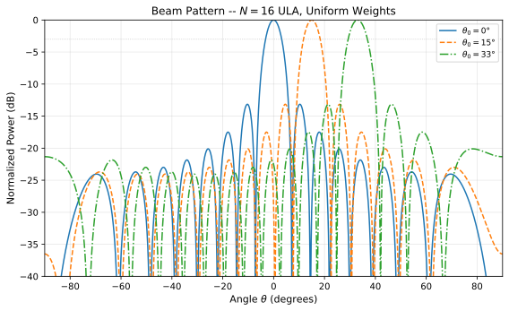
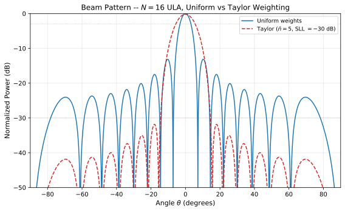

# Beamforming and Array Factor Theory

**Purpose:** Derive the array factor for a uniform linear array (ULA), beam steering, grating lobe conditions, amplitude tapering for sidelobe control, and the extension to two-dimensional planar arrays. These results form the ideal-array foundation referenced by the calibration theory document.

**Prerequisites:** Familiarity with:
- [Symbol Table](../00_notation/symbol_table.md) -- all symbols used herein
- [Parameter Table](../00_notation/parameter_table.md) -- numerical values for both variants
- [Conventions](../00_notation/conventions.md) -- equation formatting rules
- [FMCW Theory](01_fmcw_theory.md) -- wavelength and carrier frequency definitions

---

## 1. Uniform Linear Array Geometry

A uniform linear array (ULA) consists of $N$ identical antenna elements (defined in the [Symbol Table](../00_notation/symbol_table.md#antenna-and-beamforming)) arranged along a straight line with constant inter-element spacing $d$ (defined in the [Symbol Table](../00_notation/symbol_table.md#antenna-and-beamforming)). Element positions are indexed $n = 0, 1, \ldots, N-1$, with element $n$ located at position $x_n = nd$ along the array axis.

A plane wave arriving from angle $\theta$ (measured from the broadside direction, i.e., normal to the array axis) reaches each successive element with a path length difference of $d\sin\theta$ relative to its neighbor. This additional path introduces a phase delay of $kd\sin\theta$ between adjacent elements, where $k = 2\pi/\lambda$ is the wavenumber (defined in the [Symbol Table](../00_notation/symbol_table.md#antenna-and-beamforming)) and $\lambda = c/f_c$ is the wavelength from [FMCW Theory](01_fmcw_theory.md).

The inter-element phase difference due to the signal arriving at angle $\theta$ is therefore:

$$
\Delta\phi_\text{prop} = kd\sin\theta \tag{BF-1}
$$

The **far-field assumption** requires that the target range $R$ satisfies $R \gg 2(Nd)^2/\lambda$, ensuring the wavefront curvature across the array aperture is negligible and the plane-wave model of Eq. (BF-1) is valid.

> **Variant Note:**
> | | Nexus | Extended |
> |--|-------|----------|
> | Array configuration | 8x16 patch array | 32x16 slotted waveguide |
> | Elements per ULA column | 16 (8x2 subarrays) | 16 (cascaded) |
>
> See the [Parameter Table](../00_notation/parameter_table.md#antenna-and-beamforming) for element count and spacing.

---

## 2. Array Factor

The array factor $AF(\theta)$ (defined in the [Symbol Table](../00_notation/symbol_table.md#antenna-and-beamforming)) is the spatial response of the array to a plane wave arriving from angle $\theta$. Each element $n$ has an amplitude weight $w_n$ (defined in the [Symbol Table](../00_notation/symbol_table.md#antenna-and-beamforming)) and receives a progressive phase shift $\Delta\phi$ applied by the beamformer. The total electrical angle per element is:

$$
\psi = kd\sin\theta + \Delta\phi \tag{BF-2}
$$

where $\psi$ is the electrical angle (defined in the [Symbol Table](../00_notation/symbol_table.md#antenna-and-beamforming)).

The array factor is the weighted sum of the element responses:

$$
AF(\theta) = \sum_{n=0}^{N-1} w_n \, e^{jn\psi} \tag{BF-3}
$$

Each term $w_n e^{jn\psi}$ represents the contribution of element $n$: the amplitude weight $w_n$ controls how much that element contributes, and the phase $n\psi$ accounts for both the signal's angle of arrival (through $kd\sin\theta$) and the applied phase shift ($\Delta\phi$). The array factor is a polynomial in $e^{j\psi}$ of degree $N-1$, and its zeros determine the null positions of the beam pattern.

---

## 3. Beam Steering

To steer the main beam toward a desired angle $\theta_0$ (defined in the [Symbol Table](../00_notation/symbol_table.md#antenna-and-beamforming)), the beamformer applies a progressive phase shift that compensates the propagation phase at that angle:

$$
\Delta\phi = -kd\sin\theta_0 \tag{BF-4}
$$

Substituting Eq. (BF-4) into Eq. (BF-2):

$$
\psi = kd\sin\theta - kd\sin\theta_0 = kd(\sin\theta - \sin\theta_0) \tag{BF-5}
$$

At the steering direction $\theta = \theta_0$, the electrical angle becomes $\psi = 0$. Every element contributes in phase ($e^{jn \cdot 0} = 1$), producing constructive interference and maximum array response. The array factor at $\theta = \theta_0$ with uniform weights ($w_n = 1$) evaluates to $AF(\theta_0) = N$.

---

## 4. Closed-Form Array Factor (Uniform Weights)

For uniform weights ($w_n = 1$ for all $n$), the array factor in Eq. (BF-3) becomes a geometric series:

$$
AF(\theta) = \sum_{n=0}^{N-1} e^{jn\psi} \tag{BF-6}
$$

Applying the geometric series identity $\sum_{n=0}^{N-1} z^n = (1 - z^N)/(1 - z)$ with $z = e^{j\psi}$:

$$
\begin{aligned}
AF(\theta) &= \frac{1 - e^{jN\psi}}{1 - e^{j\psi}} \\
&= e^{j(N-1)\psi/2} \cdot \frac{\sin(N\psi/2)}{\sin(\psi/2)}
\end{aligned}
\tag{BF-7}
$$

The magnitude of the array factor, which determines the beam pattern, is:

$$
|AF(\theta)| = \left|\frac{\sin(N\psi/2)}{\sin(\psi/2)}\right| \tag{BF-8}
$$

The normalized power pattern, expressed as the ratio of actual power to peak power, is:

$$
P_n(\theta) = \frac{|AF(\theta)|^2}{N^2} = \frac{1}{N^2}\left(\frac{\sin(N\psi/2)}{\sin(\psi/2)}\right)^{\!2} \tag{BF-9}
$$

This closed-form expression has the following properties:
- **Main beam peak:** $P_n = 1$ (0 dB) at $\psi = 0$, i.e., $\theta = \theta_0$.
- **Nulls:** $P_n = 0$ at $\psi = 2\pi m / N$ for integer $m \neq 0$.
- **First sidelobe:** approximately $-13.3$ dB below the main beam for any $N$ (a property of the sinc-like pattern).

The figure above shows the normalized power pattern for a 16-element ULA with uniform weights at three steering angles. The main beam broadens and peak sidelobes shift as the beam is steered away from broadside, consistent with the $\cos\theta_0$ dependence derived in the next section.

---

## 5. Half-Power Beamwidth

The half-power beamwidth $\theta_{3\text{dB}}$ (defined in the [Symbol Table](../00_notation/symbol_table.md#antenna-and-beamforming)) is the angular width between the two directions where the normalized power pattern drops to half its peak value ($-3$ dB).

For a broadside beam ($\theta_0 = 0$), the $-3$ dB points of the $\sin(N\psi/2)/\sin(\psi/2)$ pattern occur at $\psi_{3\text{dB}} \approx \pm 0.886 \cdot 2\pi / N$ (the exact coefficient depends on $N$ but converges to 0.886 for large $N$, analogous to the Rayleigh criterion). Converting from $\psi$ back to $\theta$ using Eq. (BF-5) with $\theta_0 = 0$ and the small-angle approximation $\sin\theta \approx \theta$:

$$
\theta_{3\text{dB}} \approx \frac{0.886\lambda}{Nd} \tag{BF-10}
$$

For a beam steered to angle $\theta_0$, the effective aperture projected onto the wavefront direction is reduced by $\cos\theta_0$. The beamwidth broadens accordingly:

$$
\theta_{3\text{dB}}(\theta_0) \approx \frac{0.886\lambda}{Nd\cos\theta_0} \tag{BF-11}
$$

Physical interpretation: as the beam steers away from broadside, the array's projected aperture (the aperture seen by the incoming wave) shrinks, reducing the effective array length and producing a wider beam. At endfire ($\theta_0 = 90°$), $\cos\theta_0 \to 0$ and the beamwidth diverges -- the ULA cannot form a narrow beam at endfire.

---

## 6. Grating Lobe Conditions

### General Condition

Grating lobes are secondary main-beam-level maxima that occur when the electrical angle $\psi$ reaches integer multiples of $2\pi$ (other than $\psi = 0$). From Eq. (BF-5), a grating lobe appears at angle $\theta_\text{GL}$ when:

$$
kd(\sin\theta_\text{GL} - \sin\theta_0) = 2\pi m, \quad m = \pm 1, \pm 2, \ldots \tag{BF-12}
$$

Substituting $k = 2\pi/\lambda$:

$$
\frac{d}{\lambda}(\sin\theta_\text{GL} - \sin\theta_0) = m \tag{BF-13}
$$

Rearranging for the grating lobe angle:

$$
\sin\theta_\text{GL} = \sin\theta_0 + \frac{m\lambda}{d} \tag{BF-14}
$$

A grating lobe is **visible** (i.e., radiates into real space) only if $|\sin\theta_\text{GL}| \le 1$. The condition for the first grating lobe ($m = \pm 1$) to enter visible space is:

$$
\left|\sin\theta_0 \pm \frac{\lambda}{d}\right| \le 1 \tag{BF-15}
$$

### Half-Wavelength Spacing Analysis

For the standard spacing $d = \lambda/2$, Eq. (BF-14) becomes:

$$
\sin\theta_\text{GL} = \sin\theta_0 + 2m
$$

For $m = +1$: $\sin\theta_\text{GL} = \sin\theta_0 + 2$. Since $\sin\theta_0 \ge -1$, the minimum value is $\sin\theta_\text{GL} = 1$, occurring at $\theta_0 = -90°$ (endfire). For broadside ($\theta_0 = 0$), $\sin\theta_\text{GL} = 2$, which is outside visible space ($|\sin\theta| \le 1$). Thus, with $d = \lambda/2$, grating lobes never enter visible space for any scan angle -- the $\lambda/2$ spacing is the universal grating-lobe-free condition.

### Relaxed Spacing for Limited Scan Range

The preceding analysis shows that $d = \lambda/2$ prevents grating lobes for **all** scan angles up to endfire. However, the AERIS-10 system has a limited scan range of approximately $\pm 33°$ (derived from the $\pm 160°$ phase shift range of the ADAR1000; see the [Parameter Table](../00_notation/parameter_table.md#antenna-and-beamforming)). For a restricted scan range $|\theta_0| \le \theta_\text{max}$, the grating-lobe-free condition from Eq. (BF-15) for $m = -1$ (the most restrictive case when steering toward positive angles) requires:

$$
\sin\theta_\text{max} + \frac{\lambda}{d} > 1
$$

Rearranging for the maximum allowable spacing:

$$
\frac{d}{\lambda} < \frac{1}{1 + \sin\theta_\text{max}} \tag{BF-16}
$$

For $\theta_\text{max} = 33°$, this evaluates to $d/\lambda < 1/(1 + \sin 33°) \approx 1/(1 + 0.545) \approx 0.649$. The element spacing could be as large as $0.649\lambda$ (approximately $30\%$ larger than $\lambda/2$) without producing grating lobes within the $\pm 33°$ scan range. The AERIS-10 uses $d = \lambda/2 = 0.5\lambda$, which provides substantial margin against grating lobes at all scan angles within its operational range.

---

## 7. Element Pattern and Mutual Coupling

The total radiation pattern of an array is the product of the array factor and the element pattern:

$$
F_\text{total}(\theta) = AF(\theta) \cdot F_e(\theta) \tag{BF-17}
$$

where $F_e(\theta)$ is the radiation pattern of a single isolated element. This **pattern multiplication** principle holds exactly when all elements have identical radiation patterns and the array factor accounts for the inter-element phasing.

In practice, mutual coupling between elements modifies each element's radiation pattern. The **active element pattern** (AEP) differs from the isolated element pattern because currents induced on neighboring elements alter the boundary conditions. The total pattern becomes:

$$
F_\text{total}(\theta) = \sum_{n=0}^{N-1} w_n \, F_{e,n}^\text{active}(\theta) \, e^{jn\psi}
$$

where $F_{e,n}^\text{active}(\theta)$ is the active element pattern of element $n$ in the array environment. For interior elements of a large ULA, the AEPs are approximately identical by symmetry, and pattern multiplication remains a good approximation. Edge elements experience different coupling environments and exhibit modified patterns.

The impact of mutual coupling on beam pattern fidelity and the correction procedure using a coupling matrix are addressed in detail in [Calibration Theory](06_calibration_theory.md).

---

## 8. Amplitude Tapering for Sidelobe Control

The uniform-weight array factor of Eq. (BF-9) has a first sidelobe level of approximately $-13.3$ dB. Many applications require lower sidelobes to reject clutter and interference. Amplitude tapering -- applying non-uniform weights $w_n$ -- trades main beam width for reduced sidelobes.

### Taylor Weighting

The Taylor window provides a controlled tradeoff: the first $\bar{n} - 1$ sidelobes are held at a nearly constant level (the design SLL), while sidelobes farther from the main beam decay naturally. The Taylor weights are computed from the design parameters $\bar{n}$ (number of nearly-equal sidelobes) and the desired sidelobe level.

The weighted array factor from Eq. (BF-3) with Taylor weights $w_n$ replaces the uniform-weight closed form. The main beam broadens by a factor called the **beam broadening factor** $\beta_\text{BB}$, which depends on the sidelobe level:

$$
\theta_{3\text{dB}}^\text{tapered} = \beta_\text{BB} \cdot \theta_{3\text{dB}}^\text{uniform} \tag{BF-18}
$$

For a $-30$ dB Taylor taper with $\bar{n} = 5$, the beam broadening factor is approximately $\beta_\text{BB} \approx 1.25$, meaning the beam is $25\%$ wider than the uniform-weight beam.

### Chebyshev Weighting

The Dolph-Chebyshev window produces the minimum beamwidth for a given sidelobe level (or equivalently, the lowest sidelobes for a given beamwidth). All sidelobes are at exactly the design level. However, the Chebyshev taper requires larger amplitude dynamic range at the array edges, which may exceed the ADAR1000 attenuator resolution. The practical implementation of Chebyshev weights given the ADAR1000 amplitude quantization is discussed in [Calibration Theory](06_calibration_theory.md#adar1000-amplitude-quantization).

### Sidelobe-Beamwidth Tradeoff

The fundamental tradeoff is: lower sidelobes require wider main beam (reduced angular resolution) and reduced array gain. The weights $w_n$ in Eq. (BF-3) implement this tradeoff -- any window function $w[n]$ applied to the array is equivalent to amplitude tapering with weights $w_n = w[n]$, as noted in the [Symbol Table](../00_notation/symbol_table.md#antenna-and-beamforming).

The figure above compares the beam patterns of a 16-element ULA at broadside with uniform weights and Taylor weights ($\bar{n} = 5$, SLL $= -30$ dB). The Taylor taper reduces sidelobes from $-13.3$ dB to $-30$ dB at the cost of a broader main beam, illustrating the sidelobe-beamwidth tradeoff of Eq. (BF-18).

---

## 9. Two-Dimensional Array Extension

The preceding analysis treats a one-dimensional ULA. The AERIS-10 antenna configurations use two-dimensional planar arrays. For a rectangular planar array with $N_x$ elements along the $x$-axis (spacing $d_x$) and $N_y$ elements along the $y$-axis (spacing $d_y$), the array factor generalizes to:

$$
AF(\theta, \phi) = \left(\sum_{n_x=0}^{N_x - 1} w_{n_x} \, e^{jn_x \psi_x}\right) \left(\sum_{n_y=0}^{N_y - 1} w_{n_y} \, e^{jn_y \psi_y}\right) \tag{BF-19}
$$

where $\psi_x = k d_x(\sin\theta\cos\phi - \sin\theta_{0,x})$ and $\psi_y = k d_y(\sin\theta\sin\phi - \sin\theta_{0,y})$, with $\theta$ the elevation angle, $\phi$ the azimuth angle, and $(\theta_{0,x}, \theta_{0,y})$ the steering directions in each plane.

The **separability condition** in Eq. (BF-19) holds when the element weights factor as $w_{n_x, n_y} = w_{n_x} \cdot w_{n_y}$ (separable taper) and the rows and columns can be independently controlled. Under this condition, the 2D array factor is the product of two independent 1D array factors, and all the 1D results derived above apply independently in each dimension.

> **Variant Note:**
> | | Nexus | Extended |
> |--|-------|----------|
> | Array geometry | 8x16 patch array | 32x16 slotted waveguide |
> | Azimuth elements $N_x$ | 16 | 16 |
> | Elevation elements $N_y$ | 8 | 32 |
>
> See the [Parameter Table](../00_notation/parameter_table.md#antenna-and-beamforming) for array dimensions.

For the AERIS-10 system, the 8x2 ADAR1000 subarray configuration provides independent phase/amplitude control for 16 elements in the azimuth dimension. Elevation steering is handled mechanically or through subarray-level phase switching (documented in the hardware sections). The 1D ULA results of this document apply directly to the azimuth beamforming dimension.

---

## References

- [Symbol Table](../00_notation/symbol_table.md) -- canonical symbol definitions
- [Parameter Table](../00_notation/parameter_table.md) -- numerical values for both AERIS-10 variants
- [Conventions](../00_notation/conventions.md) -- equation numbering and formatting rules
- [FMCW Theory](01_fmcw_theory.md) -- wavelength $\lambda = c/f_c$ and carrier frequency definitions
- [Calibration Theory](06_calibration_theory.md) -- phase/amplitude error models and calibration correction
- Mailloux, R.J., *Phased Array Antenna Handbook*, 3rd ed., Artech House, 2018 -- Array factor derivations (Ch. 1-2), Taylor and Chebyshev tapers (Ch. 3), mutual coupling (Ch. 7)
- Van Trees, H.L., *Optimum Array Processing*, Wiley, 2002 -- Beamforming fundamentals (Ch. 2), pattern synthesis (Ch. 3)
- Skolnik, M.I., *Introduction to Radar Systems*, 4th ed., McGraw-Hill, 2008 -- Phased array antennas (Ch. 9)
