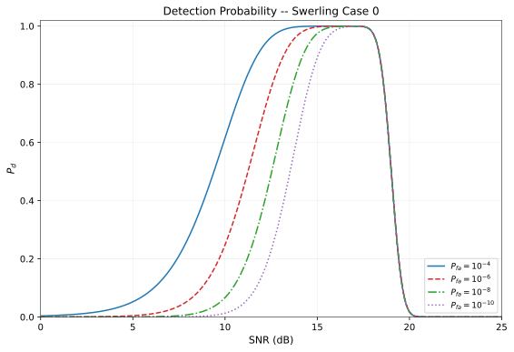
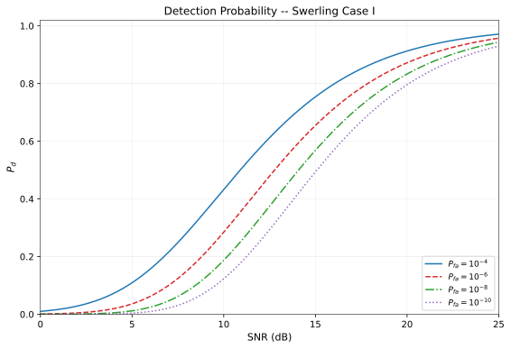

# Detection Theory

**Purpose:** Derive the detection theory chain from binary hypothesis testing through Neyman-Pearson optimality to CA-CFAR threshold computation, including Swerling target models and detection probability curves for the AERIS-10 radar system.

**Prerequisites:** Familiarity with:
- [Symbol Table](../00_notation/symbol_table.md) -- all symbols used herein
- [Parameter Table](../00_notation/parameter_table.md) -- numerical values for both variants
- [Conventions](../00_notation/conventions.md) -- equation formatting rules
- [FMCW Theory](01_fmcw_theory.md) -- radar range equation and SNR
- [LFM Waveform Model](02_lfm_waveform_model.md) -- matched filter processing gain

---

## 1. Binary Hypothesis Testing

Radar detection is fundamentally a binary decision problem: determine whether a target is present in a given range-Doppler cell or whether the cell contains only noise.

### Hypothesis Formulation

The two hypotheses are:

$$
\begin{aligned}
H_0 &: x[n] = w[n] &&\text{(noise only)} \\
H_1 &: x[n] = A \, s[n] + w[n] &&\text{(signal + noise)}
\end{aligned}
\tag{DET-1}
$$

where $x[n]$ is the observed data in the cell under test, $s[n]$ is the known signal waveform (after matched filtering), $A$ is the signal amplitude (related to SNR), and $w[n]$ is additive noise.

The detection problem is to decide between $H_0$ and $H_1$ based on the observed data $x[n]$, subject to constraints on the error rates:

- **False alarm:** Deciding $H_1$ when $H_0$ is true, with probability $P_{fa}$ (defined in the [Symbol Table](../00_notation/symbol_table.md#detection-and-signal)).
- **Detection:** Deciding $H_1$ when $H_1$ is true, with probability $P_d$ (defined in the [Symbol Table](../00_notation/symbol_table.md#detection-and-signal)).
- **Miss:** Deciding $H_0$ when $H_1$ is true, with probability $1 - P_d$.

---

## 2. Neyman-Pearson Lemma

The Neyman-Pearson lemma provides the optimal detection strategy: among all decision rules that satisfy a given false alarm probability constraint, the likelihood ratio test (LRT) maximizes the detection probability.

### Likelihood Ratio Test

The optimal detector forms the likelihood ratio and compares it to a threshold:

$$
\Lambda(x) = \frac{p(x \mid H_1)}{p(x \mid H_0)} \underset{H_0}{\overset{H_1}{\gtrless}} \gamma \tag{DET-2}
$$

where $p(x \mid H_i)$ is the probability density of the observation under hypothesis $H_i$, and $\gamma$ is the threshold chosen to achieve the desired $P_{fa}$:

$$
P_{fa} = \Pr(\Lambda(x) > \gamma \mid H_0) = \alpha_0 \tag{DET-3}
$$

The Neyman-Pearson lemma guarantees that no other test with $P_{fa} \le \alpha_0$ can achieve a higher $P_d$ than the LRT. This is the **most powerful test** at level $\alpha_0$.

### Sufficient Statistic

In practice, the full likelihood ratio need not be computed. Any monotonic function of $\Lambda(x)$ is an equivalent **sufficient statistic** for the test. For the radar detection problem, the sufficient statistic is typically the magnitude-squared of the matched filter output (Section 4).

---

## 3. Gaussian Noise Model

The standard radar detection model assumes the noise $w[n]$ in Eq. (DET-1) is complex circular Gaussian with zero mean and known variance.

### Signal Model

After matched filtering (see Eq. (LFM-8) in [`02_lfm_waveform_model.md`](02_lfm_waveform_model.md#matched-filter-definition)), the output at the target range bin is a single complex sample:

$$
\begin{aligned}
H_0 &: x = w, &&w \sim \mathcal{CN}(0, \sigma_n^2) \\
H_1 &: x = A + w, &&w \sim \mathcal{CN}(0, \sigma_n^2)
\end{aligned}
\tag{DET-4}
$$

where $\mathcal{CN}(0, \sigma_n^2)$ denotes a complex circular Gaussian distribution with variance $\sigma_n^2 = 2\sigma^2$ (where $\sigma^2$ is the per-component variance of the real and imaginary parts), and $A$ is the deterministic signal amplitude.

### Likelihood Ratio for Gaussian Case

The probability densities under each hypothesis are:

$$
\begin{aligned}
p(x \mid H_0) &= \frac{1}{\pi \sigma_n^2} \exp\!\left(-\frac{|x|^2}{\sigma_n^2}\right) \\
p(x \mid H_1) &= \frac{1}{\pi \sigma_n^2} \exp\!\left(-\frac{|x - A|^2}{\sigma_n^2}\right)
\end{aligned}
\tag{DET-5}
$$

The log-likelihood ratio simplifies to:

$$
\ln \Lambda(x) = \frac{2\operatorname{Re}(A^* x) - |A|^2}{\sigma_n^2} \tag{DET-6}
$$

Since $|A|^2$ and $\sigma_n^2$ are constants, the sufficient statistic is $T(x) = \operatorname{Re}(A^* x)$, which is the real part of the correlation between the received signal and the known signal. When the signal phase is unknown (as in most radar applications), the detector uses the magnitude $|x|$ or equivalently $|x|^2$.

### Detection Performance

For the known-signal-in-Gaussian-noise model with the magnitude-squared detector $T(x) = |x|^2$, the false alarm and detection probabilities are:

$$
P_{fa} = \exp\!\left(-\frac{\gamma}{\sigma_n^2}\right) \tag{DET-7}
$$

$$
P_d = Q_1\!\left(\sqrt{2 \cdot \text{SNR}},\; \sqrt{\frac{2\gamma}{\sigma_n^2}}\right) \tag{DET-8}
$$

where $Q_1(\cdot, \cdot)$ is the Marcum Q-function and $\text{SNR} = |A|^2 / \sigma_n^2$ is the signal-to-noise ratio. The threshold $\gamma$ is set from the desired $P_{fa}$ using Eq. (DET-7):

$$
\gamma = -\sigma_n^2 \ln(P_{fa}) \tag{DET-9}
$$

---

## 4. Square-Law Detector

In radar receivers, the complex baseband signal from the matched filter is converted to a detection statistic by taking the magnitude-squared (square-law detection). This is the sufficient statistic for detection of a signal with unknown phase in Gaussian noise.

### Test Statistic

The square-law detector computes:

$$
T = |x|^2 = (\operatorname{Re}\{x\})^2 + (\operatorname{Im}\{x\})^2 \tag{DET-10}
$$

### Distribution Under $H_0$ (Noise Only)

Under $H_0$, $x \sim \mathcal{CN}(0, \sigma_n^2)$, so $|x|^2$ follows an exponential distribution:

$$
p(T \mid H_0) = \frac{1}{\sigma_n^2}\exp\!\left(-\frac{T}{\sigma_n^2}\right), \quad T \ge 0 \tag{DET-11}
$$

This is equivalently a chi-squared distribution with 2 degrees of freedom, scaled by $\sigma^2 = \sigma_n^2/2$.

### Distribution Under $H_1$ (Signal + Noise)

Under $H_1$, $x \sim \mathcal{CN}(A, \sigma_n^2)$, so $|x|^2$ follows a non-central chi-squared distribution with 2 degrees of freedom and non-centrality parameter $\lambda_\text{nc} = 2|A|^2/\sigma_n^2 = 2\,\text{SNR}$:

$$
p(T \mid H_1) = \frac{1}{\sigma_n^2}\exp\!\left(-\frac{T + |A|^2}{\sigma_n^2}\right) I_0\!\left(\frac{2|A|\sqrt{T}}{\sigma_n^2}\right) \tag{DET-12}
$$

where $I_0(\cdot)$ is the modified Bessel function of the first kind, order zero.

---

## 5. Swerling Target Models

The analysis in Sections 2--4 assumes a deterministic (non-fluctuating) target amplitude $A$. Real radar targets have fluctuating radar cross sections (RCS), and the fluctuation statistics significantly affect detection performance. The Swerling models classify target fluctuation into five cases based on two dimensions: the RCS probability distribution and the fluctuation rate.

### Swerling Cases

$$
\begin{array}{c|c|c}
 & \textbf{Scan-to-scan} & \textbf{Pulse-to-pulse} \\
\hline
\textbf{Rayleigh (exponential)} & \text{Case I} & \text{Case II} \\
\hline
\textbf{Chi-squared (4 DOF)} & \text{Case III} & \text{Case IV} \\
\end{array}
\tag{DET-13}
$$

In addition, **Swerling Case 0** (also called Case V or the non-fluctuating case) corresponds to a deterministic target with constant RCS.

### RCS Distributions

**Case 0 (Non-fluctuating):** The RCS $\sigma$ is constant. This applies to simple targets with a single dominant scatterer (e.g., a sphere or a flat plate at normal incidence).

**Cases I and II (Rayleigh / Exponential):** The RCS follows an exponential distribution:

$$
p(\sigma) = \frac{1}{\bar{\sigma}} \exp\!\left(-\frac{\sigma}{\bar{\sigma}}\right), \quad \sigma \ge 0 \tag{DET-14}
$$

where $\bar{\sigma}$ is the mean RCS. This model applies to targets composed of many independent scatterers of comparable magnitude (e.g., aircraft, ships). The SNR is also exponentially distributed with mean $\overline{\text{SNR}}$.

**Cases III and IV (Chi-squared, 4 DOF):** The RCS follows a chi-squared distribution with 4 degrees of freedom:

$$
p(\sigma) = \frac{4\sigma}{\bar{\sigma}^2} \exp\!\left(-\frac{2\sigma}{\bar{\sigma}}\right), \quad \sigma \ge 0 \tag{DET-15}
$$

This model applies to targets with a single dominant scatterer plus many smaller scatterers (e.g., a vehicle with a large flat surface plus complex structure). The variance of $\sigma$ is smaller than in Cases I/II, so the detection performance falls between Case 0 and Cases I/II.

### Fluctuation Rate

- **Scan-to-scan (Cases I, III):** The RCS is constant within one CPI ($M$ pulses) but varies independently from scan to scan. This models targets whose aspect angle changes slowly relative to the CPI duration.
- **Pulse-to-pulse (Cases II, IV):** The RCS varies independently from pulse to pulse within a CPI. This models targets with very rapid aspect changes or very slow scan rates.

### Detection Performance Impact

For single-pulse detection, the detection probability for Swerling Case I (exponential fluctuation) has a closed-form expression:

$$
P_d = P_{fa}^{1/(1 + \overline{\text{SNR}})} \tag{DET-16}
$$

For Swerling Case 0, $P_d$ must be computed numerically via the Marcum Q-function (Eq. (DET-8)). At high SNR, Case 0 achieves higher $P_d$ than Case I because the non-fluctuating target provides a consistent return. At low SNR, Case I can occasionally exceed Case 0 due to favorable fluctuations, but on average requires higher SNR for a given $P_d$.

---

## 6. CA-CFAR Derivation

The detection threshold in Eqs. (DET-7) and (DET-9) requires knowledge of the noise power $\sigma_n^2$. In practice, the noise power is unknown and varies with range, Doppler, and time due to clutter, interference, and environmental changes. Constant False Alarm Rate (CFAR) detectors estimate the noise power adaptively from the data.

### Sliding Window Architecture

The Cell-Averaging CFAR (CA-CFAR) detector estimates the noise power from reference cells surrounding the cell under test (CUT). The architecture consists of:

- **Cell under test (CUT):** The range-Doppler cell being tested for target presence.
- **Guard cells:** $N_\text{guard}$ cells (defined in the [Symbol Table](../00_notation/symbol_table.md#detection-and-signal)) immediately adjacent to the CUT on each side, excluded from the noise estimate to prevent target energy from biasing the estimate.
- **Reference cells:** $N_\text{ref}$ cells (defined in the [Symbol Table](../00_notation/symbol_table.md#detection-and-signal)) on each side of the guard band, used to estimate the local noise power.

The total number of reference cells is $N_\text{ref}$ (counting both sides combined).

### Noise Power Estimate

The CA-CFAR estimates the noise power as the average of the square-law detector outputs in the reference cells:

$$
\hat{P}_n = \frac{1}{N_\text{ref}} \sum_{i=1}^{N_\text{ref}} T_i \tag{DET-17}
$$

where $T_i = |x_i|^2$ is the square-law output of the $i$-th reference cell.

**Assumption:** The reference cells contain independent, identically distributed (i.i.d.) samples of noise only, each following the exponential distribution of Eq. (DET-11). This is the homogeneous noise environment assumption.

### Threshold Multiplier Derivation

The CFAR detection test compares the CUT power to the scaled noise estimate:

$$
T_\text{CUT} \underset{H_0}{\overset{H_1}{\gtrless}} \alpha \cdot \hat{P}_n \tag{DET-18}
$$

where $\alpha$ is the CFAR threshold multiplier (defined in the [Symbol Table](../00_notation/symbol_table.md#detection-and-signal)).

To derive $\alpha$, we require $P_{fa} = \Pr(T_\text{CUT} > \alpha \, \hat{P}_n \mid H_0)$.

Under $H_0$, $T_\text{CUT}$ is exponentially distributed with parameter $\sigma_n^2$, and the sum $S = \sum_{i=1}^{N_\text{ref}} T_i$ follows a Gamma distribution $\Gamma(N_\text{ref}, \sigma_n^2)$ (since it is the sum of $N_\text{ref}$ i.i.d. exponential random variables). The test becomes $T_\text{CUT} > \alpha \, S / N_\text{ref}$.

The false alarm probability evaluates to:

$$
P_{fa} = \left(1 + \frac{\alpha}{N_\text{ref}}\right)^{-N_\text{ref}} \tag{DET-19}
$$

Solving for the threshold multiplier:

$$
\boxed{\alpha = N_\text{ref}\!\left(P_{fa}^{-1/N_\text{ref}} - 1\right)} \tag{DET-20}
$$

This is the standard CA-CFAR threshold multiplier formula (Skolnik, Richards). The derivation rests on two critical assumptions:

1. **I.I.D. exponential reference cells:** The noise samples in the reference cells are independent and identically distributed, each following an exponential distribution (equivalently, the complex noise is i.i.d. circular Gaussian).
2. **Homogeneous environment:** No targets, clutter edges, or interference sources contaminate the reference window.

When these assumptions hold, the CA-CFAR achieves exactly the designed $P_{fa}$ regardless of the absolute noise power level -- hence "constant false alarm rate."

---

## 7. Detection Probability Curves

The detection probability $P_d$ as a function of SNR, parametric in $P_{fa}$, is the standard performance metric for a radar detector. These curves quantify the SNR required to achieve a specified detection probability at a given false alarm rate.

### Swerling Case 0 (Non-Fluctuating Target)

For a non-fluctuating target with the square-law detector, $P_d$ is computed from the Marcum Q-function (Eq. (DET-8)):

$$
P_d = Q_1\!\left(\sqrt{2 \cdot \text{SNR}},\; \sqrt{-2\ln(P_{fa})}\right) \tag{DET-21}
$$

where the threshold has been expressed in terms of $P_{fa}$ using Eq. (DET-9). These curves are monotonically increasing in SNR: as SNR increases, $P_d$ approaches unity for any $P_{fa}$.

The figure shows $P_d$ vs. SNR for $P_{fa} \in \{10^{-4}, 10^{-6}, 10^{-8}, 10^{-10}\}$. As the false alarm constraint becomes more stringent (lower $P_{fa}$), a higher SNR is required to achieve the same $P_d$. The curves exhibit a steep transition region: for typical radar requirements ($P_d \ge 0.9$), the required SNR is concentrated in a narrow range determined by $P_{fa}$.

### Swerling Case I (Scan-to-Scan Rayleigh Fluctuation)

For a Swerling Case I target with single-pulse detection, the closed-form expression of Eq. (DET-16) gives:

$$
P_d = P_{fa}^{1/(1 + \overline{\text{SNR}})} \tag{DET-22}
$$

Compared to Case 0, Swerling Case I requires significantly higher SNR to achieve the same $P_d$. The exponential RCS fluctuation means the target occasionally presents a very small cross section, making consistent detection more difficult. The SNR penalty for fluctuating targets increases as the required $P_d$ increases.

### Required SNR Comparison

At representative operating points, the SNR required for Case I exceeds that for Case 0 by several dB. This difference is the **fluctuation loss** -- the additional SNR required to overcome target RCS fluctuation. The fluctuation loss increases with increasing $P_d$ requirement and is typically in the range of several dB for single-pulse detection.

---

## 8. CFAR Loss

The CA-CFAR detector estimates noise power from a finite number of reference cells, introducing estimation uncertainty. This uncertainty degrades detection performance relative to an ideal fixed-threshold detector that knows the true noise power exactly.

### Definition

The CFAR loss is the SNR penalty (in dB) required by the CA-CFAR detector to achieve the same $(P_d, P_{fa})$ operating point as the ideal Neyman-Pearson detector with known noise power:

$$
L_\text{CFAR}\,[\text{dB}] = \text{SNR}_\text{CFAR} - \text{SNR}_\text{NP} \tag{DET-23}
$$

### Dependence on Reference Window Size

The CFAR loss decreases as the number of reference cells $N_\text{ref}$ increases, because the noise power estimate improves with more samples. The approximate CFAR loss for the CA-CFAR detector is:

$$
L_\text{CFAR} \approx \frac{1}{N_\text{ref}} \cdot \frac{P_d}{(1 - P_d) \ln(P_{fa})} \tag{DET-24}
$$

This expression (from Richards) shows that:

1. **More reference cells reduce loss:** $L_\text{CFAR} \propto 1/N_\text{ref}$. Doubling the reference window halves the CFAR loss.
2. **Higher $P_d$ requirement increases loss:** The penalty grows as the operating point approaches $P_d = 1$.
3. **Stricter $P_{fa}$ increases loss:** Lower false alarm rates require more precise noise estimation.

> **Design Guideline:**
> | $N_\text{ref}$ | Approximate CFAR Loss |
> |---|---|
> | 16 | ~$1.5~\text{dB}$ |
> | 24 | ~$1.0~\text{dB}$ |
> | 32 | ~$0.8~\text{dB}$ |
> | 64 | ~$0.4~\text{dB}$ |
>
> These values are representative for $P_d = 0.9$ and $P_{fa} = 10^{-6}$. The actual CFAR loss for the AERIS-10 system depends on the specific $N_\text{ref}$ and $N_\text{guard}$ implemented in the FPGA CFAR module.

---

## 9. Non-Homogeneous Environments

The CA-CFAR derivation in Section 6 assumes a homogeneous noise environment: all reference cells contain i.i.d. samples from the same distribution. When this assumption is violated, the CA-CFAR performance degrades.

### Failure Modes

**Clutter edges:** When the reference window spans the boundary between a clutter region and a clear region, the noise estimate is biased. Reference cells in the clutter region elevate the noise estimate, raising the threshold and masking targets in the clear region. Conversely, reference cells in the clear region underestimate the noise in the clutter region, increasing the false alarm rate.

**Multiple targets in the reference window:** When a second target falls within the reference cells, its energy elevates the noise power estimate, raising the threshold around the cell under test. This phenomenon, called **target masking**, reduces $P_d$ for the primary target. With $k$ interfering targets in the reference window, the noise estimate is biased upward by a factor proportional to $k \cdot \text{SNR}_\text{interferer} / N_\text{ref}$.

### Alternative CFAR Architectures

Several CFAR variants address the non-homogeneous environment problem:

- **Greatest-Of CFAR (GO-CFAR):** Computes the noise estimate separately from the leading and lagging reference windows and uses the greater of the two estimates. This prevents false alarms at clutter edges but increases target masking.

- **Smallest-Of CFAR (SO-CFAR):** Uses the smaller of the two noise estimates. This reduces target masking but can increase false alarms at clutter edges.

- **Ordered-Statistic CFAR (OS-CFAR):** Ranks the reference cell values and uses the $k$-th order statistic as the noise estimate. This provides robustness against multiple interfering targets (up to $N_\text{ref} - k$ interferers) at the cost of higher CFAR loss and computational complexity.

These CFAR variants and their suitability for the AERIS-10 system are the subject of a dedicated research survey in Phase 5 (SWRES-01). The current FPGA implementation uses a specific CFAR variant that will be documented in Phase 4 (SWDOC-01).

---

## References

- [Symbol Table](../00_notation/symbol_table.md) -- canonical symbol definitions
- [Parameter Table](../00_notation/parameter_table.md) -- numerical values for both AERIS-10 variants
- [Conventions](../00_notation/conventions.md) -- equation numbering and formatting rules
- [FMCW Theory](01_fmcw_theory.md) -- radar range equation and single-pulse SNR
- [LFM Waveform Model](02_lfm_waveform_model.md) -- matched filter processing gain
- Skolnik, M.I., *Introduction to Radar Systems*, 4th ed., McGraw-Hill, 2008 -- Detection theory (Ch. 5), CFAR (Ch. 5.7), Swerling models (Ch. 5.5)
- Richards, M.A., *Fundamentals of Radar Signal Processing*, 2nd ed., McGraw-Hill, 2014 -- Detection and CFAR (Ch. 10), Neyman-Pearson criterion (Ch. 10.2)
- Kay, S.M., *Fundamentals of Statistical Signal Processing: Detection Theory*, Prentice Hall, 1998 -- Neyman-Pearson lemma (Ch. 3), likelihood ratio test (Ch. 3-4)
- Mahafza, B.R., *Radar Systems Analysis and Design Using MATLAB*, 3rd ed., CRC Press, 2013 -- CFAR implementation (Ch. 7), detection probability computation (Ch. 6)
