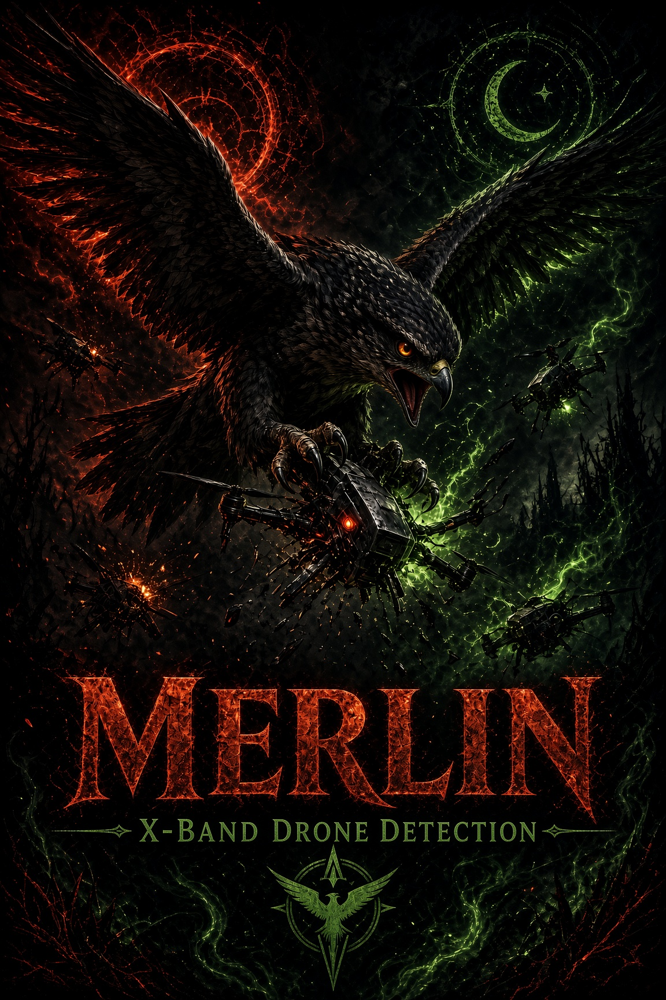

<!--
  MERLIN · Obsidian Forged Systems
  Phased Array Radar · RF Engineering · FPGA Signal Processing · Systems Documentation
  Template: OFS-README-TPL v1.0
-->

<div align="center">
  
</div>

<br/>

<p align="center">
  
  
  
  
</p>

---

## Abstract

The AERIS-10 X-band (10.5 GHz) PLFM phased array radar is a fully operational open-hardware system whose engineering knowledge existed only as tribal knowledge and scattered source files, making maintenance, debugging, and upgrade decisions dependent on individual memory rather than auditable documentation. MERLIN produces an engineering-grade documentation and research corpus for the complete system — a layered stack running from a canonical notation/parameter baseline through first-principles physics derivations (FMCW theory, LFM waveforms, beamforming, CFAR detection, cascaded noise figure), hardware subsystem documentation (RF front-end, frequency synthesis, FPGA board, power management, timing budget), and software documentation (FPGA DSP pipeline, STM32 firmware, Python GUI, USB protocol), capped by eight improvement research surveys evaluated against the documented baseline. The corpus is strictly layered and cross-reference enforced: no derivation may define a numerical value outside the master parameter table, and no research survey references a subsystem that is not yet documented — eliminating the notation-drift failure mode that kills multi-document engineering sets. All six phases (21 plans) are complete, including resolution of four parameter inconsistencies discovered across firmware, FPGA, GUI, and legacy documentation (e.g., a 10.0 vs 10.5 GHz center-frequency conflict traced to a stale GUI default).

> **Design intent:** A radar the engineering team can maintain, debug, and extend from the documentation alone — zero tribal knowledge required.

---

## Project Dashboard

<div align="center">

| Metric | Target | Current | Δ |
|:-------|:------:|:-------:|:--:|
| **Schedule** — Milestone v1.0 | 2026-03 | 95% complete | ON_TRACK |
| **Documentation Phases** | 6 | 6 complete | ON_TRACK |
| **Plans Executed** | 21 | 21 | ON_TRACK |
| **Parameter Conflicts Resolved** | 4 | 4 | ON_TRACK |
| **Cross-Reference Consistency Pass** | 100% | Pending final V&V | — |
| **Open Risks (High)** | 0 | 1 | — |

</div>

---

## Scope & Objectives

**In scope**

- Document all software subsystems by signal/data flow: FPGA Verilog pipeline (DDC → CIC decimation → matched filter → 1024-pt FFT → CFAR), STM32F746 firmware, Python/Tkinter GUI (DBSCAN clustering, Kalman tracking), and FT601 USB 3.0 protocol
- Document all hardware subsystems with component specs, register maps, timing and power budgets: RF front-end, frequency synthesis, antenna/beamforming, FPGA board, power management, GPS/IMU transforms
- Derive system physics from first principles with full step-by-step derivations: FMCW theory with range-Doppler coupling, LFM waveform model, 16-element array factor, Neyman-Pearson → CFAR detection theory, cascaded noise figure, antenna calibration
- Survey software improvements with feasibility assessments: CFAR variants, clutter rejection, ML-based detection, pulse compression, FPGA optimization, target tracking, adaptive beamforming
- Survey hardware upgrade paths with noise-figure impact analysis: GaN vs SiGe front-ends, synthesizer phase noise, ADC upgrade, FPGA upgrade, range extension
- Enforce project-wide notation (IEEE 686-2024) and a single canonical parameter table across all documents

**Explicitly out of scope**

- Implementation of any surveyed improvement — this repository is documentation and research only
- User manuals or operator guides — audience is the engineering team, not end users
- Regulatory/compliance documentation (EMC, safety) and marketing material

**Success criteria** — the project is *done* when: an engineer with no prior AERIS-10 exposure can trace any signal processing operation from first-principles physics through hardware component to software implementation using only the documents in this repository, with every symbol and parameter resolving to the canonical tables.

---

## System Architecture

The repository mirrors the system's layered dependency structure — each documentation layer assigns concrete values to the abstractions of the layer above it:

```text
┌─────────────────┐     ┌──────────────────┐     ┌──────────────────┐
│  00_notation     │────▶│  01_physics      │────▶│  02_hardware      │
│  Symbol/param    │     │  First-principles│     │  Component specs, │
│  canonical tables│     │  derivations     │     │  register maps    │
└─────────────────┘     └──────────────────┘     └──────────────────┘
        │                        │                        │
        ▼                        ▼                        ▼
┌─────────────────┐     ┌──────────────────┐
│  03_software     │────▶│  04_research     │
│  FPGA/STM32/GUI  │     │  8 improvement   │
│  by data flow    │     │  surveys vs.     │
└─────────────────┘     │  documented base │
                        └──────────────────┘
```

**Documented system (AERIS-10):**

| Layer | Component | Interface / Protocol | Notes |
|:------|:----------|:---------------------|:------|
| Waveform | DAC + LT5552 mixers | Analog IF / X-band | LFM chirp generation, up/down conversion |
| Beamforming | 4× ADAR1000 + 16× ADTR1107 | SPI (STM32-configured) | ±45° electronic steering, az + el |
| Frequency synthesis | AD9523-1 + 2× ADF4382 | SPI / phase-aligned clocks | Phase noise is the dominant coherence constraint |
| Digitization | AD9484 14-bit ADC | 400 MHz parallel → FPGA | ADC rate anchors decimation chain design |
| Signal processing | XC7A100T Artix-7 FPGA | FT601 USB 3.0 to host | DDC → CIC → matched filter → FFT → Doppler/MTI/CFAR |
| System control | STM32F746 | SPI/I²C to all peripherals | Power sequencing, GPS/IMU, thermal, stepper |
| Visualization | Python/Tkinter GUI | USB 3.0 | DBSCAN clustering, Kalman tracking, map overlay |

---

## Dependencies & Environment

### Runtime / Software

| Dependency | Version | Purpose | Pinned? |
|:-----------|:-------:|:--------|:-------:|
| Python | 3.8+ | GUI, utility scripts, radar equation tools | ⚠️ floating |
| Vivado | 2022.x+ | FPGA pipeline modification/rebuild | ⚠️ floating |
| STM32CubeIDE | Latest | Firmware builds | ⚠️ floating |
| KaTeX-capable renderer | — | Physics derivations render inline math | ✅ (GitHub native) |

### Hardware / Physical (documented baseline)

| Item | Spec | Qty | Source | Notes |
|:-----|:-----|:---:|:-------|:------|
| FPGA | Xilinx XC7A100T Artix-7 | 1 | AMD/Xilinx | Resource utilization documented in 02_hardware |
| MCU | STM32F746xx | 1 | ST | Power sequencing is safety-critical path |
| Beamformer | ADAR1000 (4-ch) | 4 | ADI | Phase/amplitude cal theory in 01_physics |
| Front-end | ADTR1107 | 16 | ADI | LNA/PA per element |
| PA (Extended) | QPA2962 GaN, 10 W | 16 | Qorvo | AERIS-10X only; thermal path documented |
| ADC | AD9484, 14-bit 400 MHz | 1 | ADI | Upgrade path surveyed in 04_research |

### Environmental Requirements

- **Power:** Sequenced multi-rail (STM32-enforced); power budget documented in `02_hardware/08_power_budget.md`
- **Network:** Fully offline-capable; corpus is plain Markdown + local assets, zero external calls
- **Thermal / Enclosure:** 8× temperature sensors drive fan control; GaN PA thermal constraints documented
- **RF / EMI:** X-band (10.5 GHz) emitter — operation subject to local spectrum authorization; documentation itself carries no RF risk
- **Security posture:** All content local-first; no telemetry, no build-time network dependencies

---

## Milestones & Roadmap

| ID | Milestone | Exit Criteria | Target | Status |
|:--:|:----------|:--------------|:------:|:------:|
| M1 | Notation & Parameter Standardization | IEEE 686-2024 symbol table + canonical parameter table for both variants; 4 codebase inconsistencies resolved | 2026-03-13 | ✅ |
| M2 | Physics Foundation | FMCW, LFM, beamforming, CFAR, noise figure, calibration derived from first principles | 2026-03-13 | ✅ |
| M3 | Hardware Documentation | All 9 subsystem docs with register maps, timing + power budgets | 2026-03-13 | ✅ |
| M4 | Software Documentation | FPGA pipeline, STM32 firmware, GUI, USB protocol documented by data flow | 2026-03-14 | ✅ |
| M5 | Software Improvement Research | 8 surveys w/ feasibility vs documented baseline | 2026-03-14 | ✅ |
| M6 | Hardware Improvement Research | RF/ADC/FPGA upgrade paths w/ noise figure impact | 2026-03-14 | ✅ |
| M7 | v1.0 Cross-Reference V&V | Every symbol/parameter/equation reference resolves; consistency pass clean | TBD | 🟡 |

---

## Risk Register

| ID | Risk | L | C | Score | Mitigation | Owner | Status |
|:--:|:-----|:-:|:-:|:-----:|:-----------|:-----:|:------:|
| R1 | If upstream hardware (AERIS-10 codebase/PCB) diverges after mirror, then documentation silently describes a stale system, resulting in wrong maintenance decisions | 3 | 4 | 12 | Pin documented baseline to upstream commit hash in changelog; diff-review upstream on any hardware change before citing docs | OFS | Open |
| R2 | If vendor datasheets in `7_Components...` (63 MB) carry redistribution restrictions, then public mirror creates IP exposure, resulting in takedown or license conflict | 3 | 3 | 9 | Audit datasheet licenses; replace restricted PDFs with links + local retention; consider private visibility until cleared | OFS | Open |
| R3 | If known codebase defects flagged in parameter table (e.g., GUI `system_frequency = 10e9`) remain unpatched, then doc-vs-code mismatch persists, resulting in operator confusion | 4 | 2 | 8 | Track flagged corrections as issues; docs remain canonical until code patched | OFS | Watch |
| R4 | If final V&V cross-reference pass is skipped, then broken symbol/equation references degrade trust in the whole corpus | 2 | 4 | 8 | M7 exit criteria enforced before v1.0 tag; automated link/reference check script | OFS | Open |

---

## Verification & Test

| Test | Method | Requirement Traced | Result | Evidence |
|:-----|:-------|:-------------------|:------:|:---------|
| Symbol table coverage — every symbol in 01–04 defined in `00_notation/symbol_table.md` | Analysis (grep audit) | NOTN-01 | PASS | Phase 1 verification |
| Canonical parameter uniqueness — no numeric parameter defined outside master table | Analysis | NOTN-02 | PASS | `00_notation/parameter_table.md` |
| Derivation traceability — every DSP operation traces to a physics derivation | Review | PHYS-01…07 | PASS | Phase 2/4 verification docs |
| Cross-reference resolution — all inter-document links + equation refs valid | Script / Analysis | All | PENDING | M7 |

**Repro:** `python3 8_Utils/Python/RADAR_eq.py` (baseline radar-equation sanity check) · reference audits per `.planning/phases/*/[0-9][0-9]-VERIFICATION.md`

---

## Quick Start

```bash
# Clone
git clone https://github.com/Crusader0711/Merlin.git
cd Merlin

# Read in dependency order
# 00_notation → 01_physics → 02_hardware → 03_software → 04_research

# Verify baseline math tooling
python3 8_Utils/Python/RADAR_eq.py
```

---

## Tech Stack

<p align="left">
  
  
  
  
  
  
</p>

---

## Changelog

| Version | Date | Change |
|:-------:|:----:|:-------|
| v0.9.5 | 2026-08-22 | Mirrored GRYFALC0N into Merlin (baseline efae9a23ba9b); adopted OFS-README-TPL v1.0; upstream AERIS-10 README preserved as `docs/UPSTREAM_README.md` |
| v0.9.0 | 2026-03-14 | Completed Phases 5–6 (software + hardware improvement research, 8 surveys) |
| v0.5.0 | 2026-03-13 | Completed Phases 1–4 (notation, physics, hardware, software documentation) |
| v0.1.0 | 2026-03-13 | Initial architecture and baseline commit |

---

## Connect

<p align="center">
  <a href="https://github.com/Crusader0711"></a>
  <a href="https://x.com/Crusader2C7"></a>
  <a href="https://medium.com/@Crusader2c7"></a>
</p>

---

<div align="center">
  <sub>Obsidian Forged Systems · MERLIN · Built for environments that punish fragility</sub>
</div>
